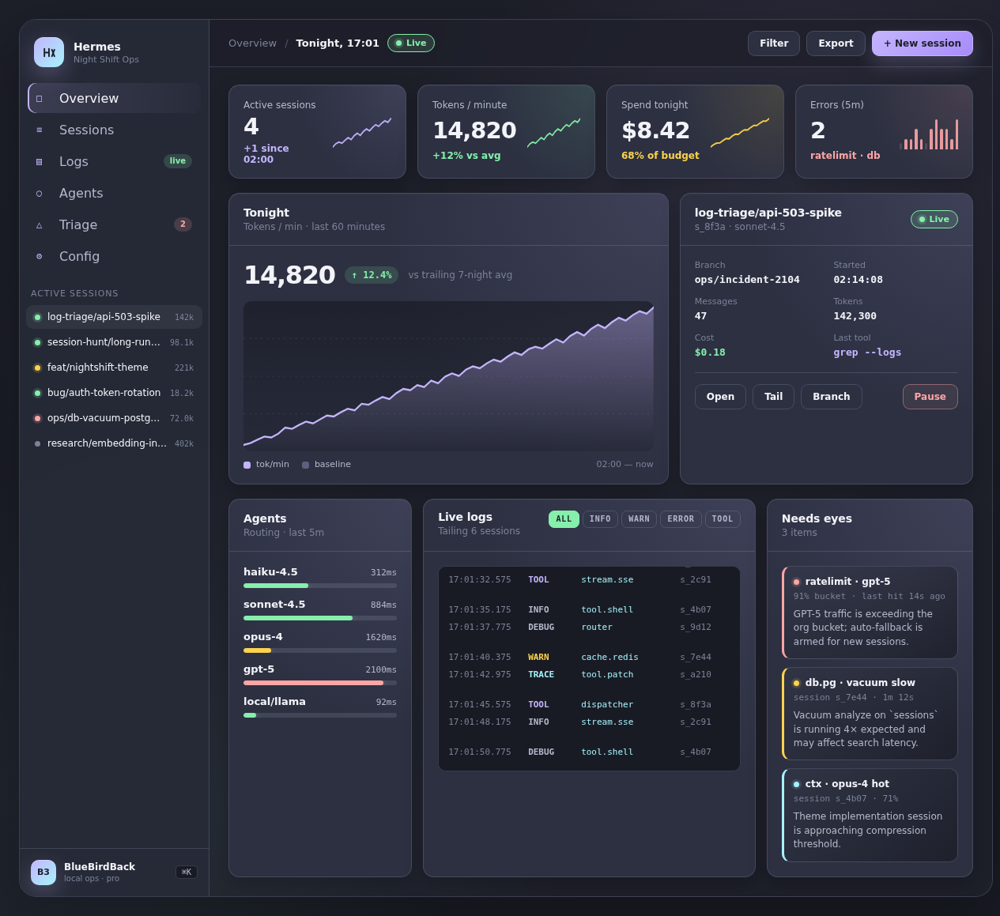
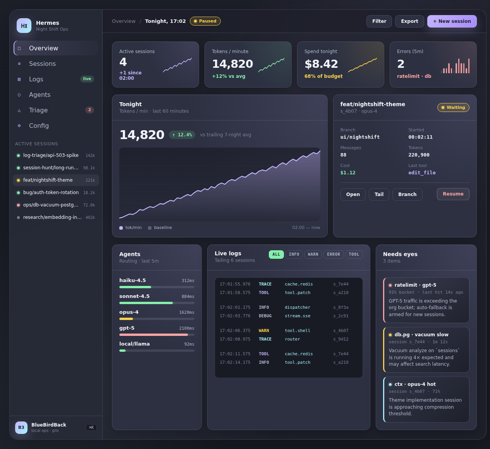

# Hermes Dashboard Theme: Night Shift Ops

A quiet, high-density **Hermes Agent dashboard theme** for late-night ops work: logs, sessions, agent load, budget drift, and “needs eyes” triage.

The 2026 redesign moves the theme from neon showcase toward a calmer **Quiet Ops** system: dark layered surfaces, soft violet focus, muted semantic status colors, compact cards, and readable live-log typography.

## What ships

- `theme/nightshift-ops.yaml` — installable Hermes dashboard theme
- `dashboard/` — optional plugin that adds a `/nightshift` showcase tab
- `screenshots/` — preview images of the redesigned theme/plugin

The theme is the main deliverable. The plugin is a richer preview surface for the design language.

## Design language

- **Calm dark surfaces**: charcoal/navy base, slate cards, subtle borders
- **Soft violet primary**: focused but not neon
- **Muted ops statuses**: green live, amber warning, rose danger, cyan info
- **Dense scanning layout**: KPI cards, session detail, agent load bars, live logs, triage queue
- **Practical typography**: clean UI font with mono numerics/log rows

## Screenshots

### Quiet Ops plugin dashboard


### Theme / palette detail


## Install

```bash
git clone https://github.com/BlueBirdBack/hermes-dashboard-nightshift-ops.git
cd hermes-dashboard-nightshift-ops
./install.sh
hermes dashboard
```

Then open the theme picker in the dashboard header and choose **Night Shift Ops**.

## Manual install

```bash
git clone https://github.com/BlueBirdBack/hermes-dashboard-nightshift-ops.git ~/.hermes/plugins/nightshift-ops
mkdir -p ~/.hermes/dashboard-themes
cp ~/.hermes/plugins/nightshift-ops/theme/nightshift-ops.yaml ~/.hermes/dashboard-themes/nightshift-ops.yaml
hermes dashboard
```

## Use

1. Open the Hermes dashboard.
2. Pick **Night Shift Ops** from the theme switcher.
3. Open the **Night Shift** tab for the redesigned Quiet Ops preview.

## Files

```text
nightshift-ops/
├── plugin.yaml
├── install.sh
├── theme/
│   └── nightshift-ops.yaml
├── dashboard/
│   ├── manifest.json
│   └── dist/
│       ├── index.js
│       └── style.css
└── screenshots/
```

## Notes

- Zero build step: theme is YAML; plugin is prebuilt plain JS + CSS.
- The plugin applies the same CSS variables as the theme so screenshots look close to real dashboard usage.
- Remove the theme by deleting `~/.hermes/dashboard-themes/nightshift-ops.yaml` and unlinking `~/.hermes/plugins/nightshift-ops`.

## License

MIT
