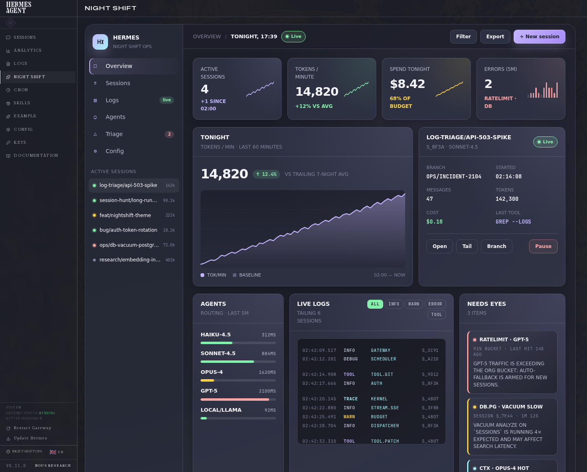

# Night Shift Ops for Hermes Dashboard

A quiet dark theme for the **Hermes Agent dashboard**, plus an optional **Night Shift** dashboard tab for ops-style monitoring.

It is designed for late-night agent work: sessions, logs, model routing, token usage, cost, and “needs eyes” triage.

## What this repo includes

- `theme/nightshift-ops.yaml` — the actual Hermes dashboard theme.
- `dashboard/` — an optional plugin that adds a **Night Shift** tab.
- `screenshots/` — real dashboard and showcase screenshots.

The theme changes the normal Hermes dashboard colors. The plugin adds the richer Night Shift demo/ops page.

## Real dashboard screenshot

This is a real Hermes dashboard capture at **1440px wide**. It includes the normal Hermes Agent shell/sidebar because that is what you see when running the dashboard.



## Showcase screenshots

These older screenshots focus on the Night Shift plugin UI by itself. They are useful for seeing the design language, but the real dashboard view above is more accurate for what you will see after installation.


## Install

```bash
git clone https://github.com/BlueBirdBack/hermes-dashboard-nightshift-ops.git
cd hermes-dashboard-nightshift-ops
./install.sh
```

The installer does two things:

1. Links this repo as a Hermes plugin at `~/.hermes/plugins/nightshift-ops`.
2. Copies the theme file to `~/.hermes/dashboard-themes/nightshift-ops.yaml`.

## Use it locally

Start the dashboard:

```bash
hermes dashboard
```

Then:

1. Open the dashboard URL printed by Hermes.
2. Open **Switch theme**.
3. Choose **Night Shift Ops**.
4. Click **Night Shift** in the left sidebar to open the plugin page.

You can also set the theme from the terminal:

```bash
hermes config set dashboard.theme nightshift-ops
hermes dashboard
```

## Use it on a VPS

On the VPS:

```bash
cd hermes-dashboard-nightshift-ops
./install.sh
hermes config set dashboard.theme nightshift-ops
hermes dashboard --host 127.0.0.1 --port 9123 --no-open
```

On your laptop, open an SSH tunnel:

```bash
ssh -L 9123:127.0.0.1:9123 root@YOUR_SERVER_IP
```

Then visit:

```text
http://127.0.0.1:9123/nightshift
```

## Update later

```bash
cd hermes-dashboard-nightshift-ops
git pull
./install.sh
```

Restart the dashboard if it was already running.

## Remove

```bash
rm -f ~/.hermes/dashboard-themes/nightshift-ops.yaml
rm -f ~/.hermes/plugins/nightshift-ops
```

If you set this as your active theme, choose another theme in the dashboard or return to the built-in default:

```bash
hermes config set dashboard.theme default
```

## Design notes

- Dark charcoal/navy surfaces.
- Soft violet primary accent.
- Muted green/yellow/red/cyan status colors.
- Dense cards for sessions, logs, routing, cost, and triage.
- Plain prebuilt JavaScript/CSS; no build step is required.

## Files

```text
nightshift-ops/
├── plugin.yaml
├── install.sh
├── theme/
│   └── nightshift-ops.yaml
├── dashboard/
│   ├── manifest.json
│   └── dist/
│       ├── index.js
│       └── style.css
└── screenshots/
    ├── nightshift-real-dashboard-1440.png
    ├── nightshift-status.png
    └── nightshift-plugin-page.png
```

## License

MIT
